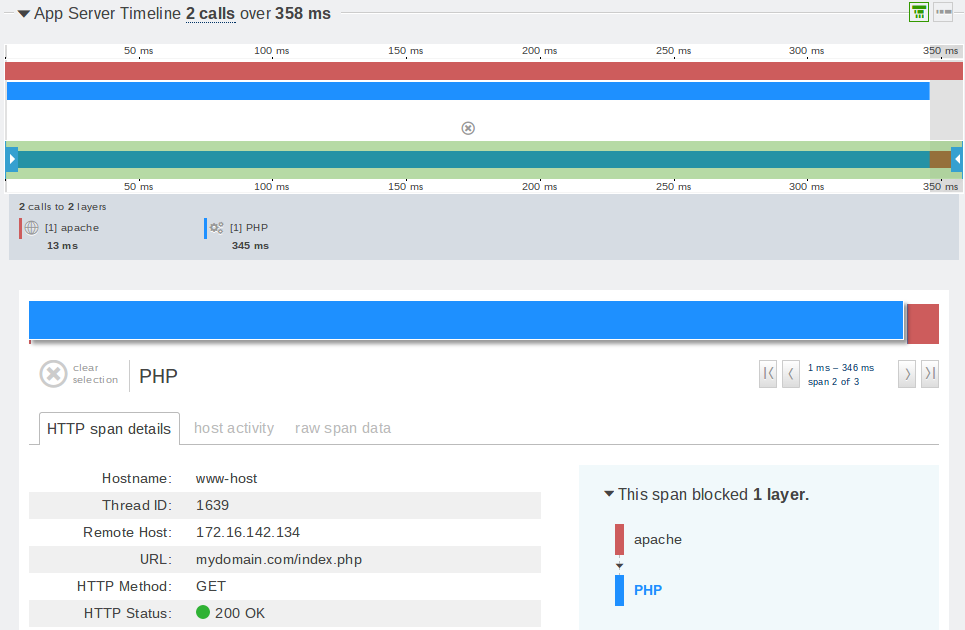
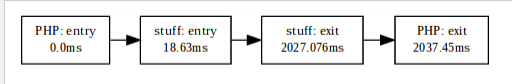
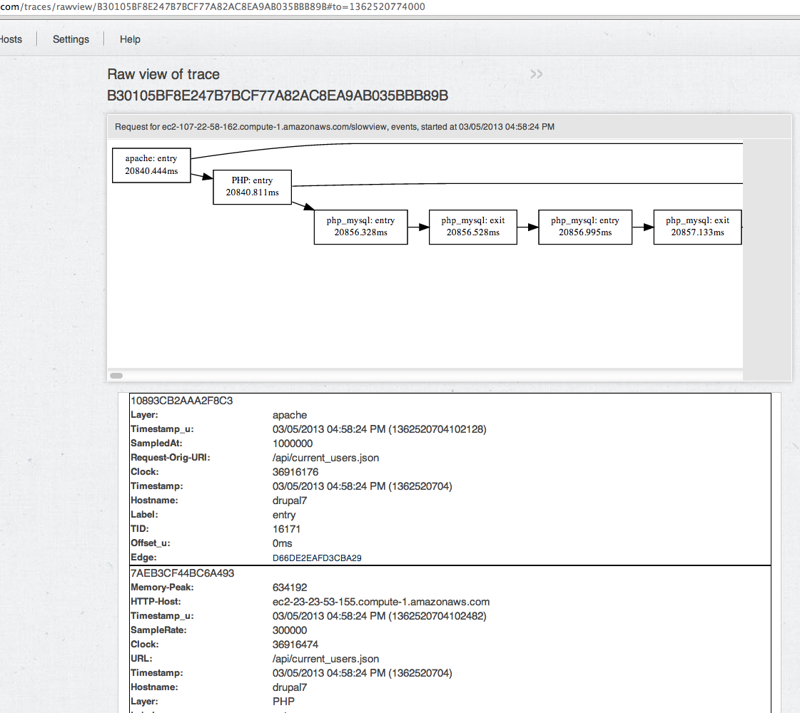

WRITING INSTRUMENTATION
v0.1
## INSTRUMENTATION OVERVIEW

### What it does, how it does it.

A trace starts its life as a series of *events* in a distributed system--your web app. An **event** indicates a point in the flow of control of a request through the application. Sets of **events** are joined together to form *extents*, which represent execution flow and timing in a particular call to a *layer* of an app. A **trace** is the full record of a request and is composed of **extents** which are composed of **events**. The *context* is the minimal current state of the **trace** and is passed throughout the request across layers (TODO: link to RPC guide) to ensure all events are tied together properly.

Below is a *rawview* (TODO: link to rawview) of four events grouped into a pair of parent and child extents.

Here is the trace details view of the above four event / two extent grouping.

All the instrumentation has to do is create the events properly, and the rest is inferred by our data processing.

Concept | Represents | Looks Like
--------|------------|-----------
Event | Point in time of execution. | Bag of key-value pairs containing structal, timing, and diagnostic info.
Extent | Execution of a call into a particular layer of the stack. | Set of events (two or more) representing the work done in that layer.
Trace | The execution of a request through a web app / distributed system. | Set of events, interpreted into extents.
Context | Trace ID and last event id | 29 byte string (usually seen as 58 chars in hex; 2 char header, 40 char trace ID, 16 char event ID)

TODO: Layer and span concepts?

## HOW THIS GUIDE WORKS

Introduction (you're here)

Trace Something New in 60 Seconds -- a quick tutorial

Events and Extents -- the building blocks of instrumentation

Layers and Profiles -- processing at work

Broken Traces -- what can go wrong

How To: Asynchronous and Parallel Workflows -- how to represent the control flow of complex applications

How-To: Full-Stack Tracing -- following requests across RPC boundaries

How-To: Starting and Ending Traces

Appendix: Instrumentation APIs

Appendix: Key-value interfaces for extent types

Appendix: Zero-diff Instrumentation -- metaprogramming instrumentation that hooks into your code without requiring you to modify it

# TRACE SOMETHING NEW IN 60 SECONDS

Is there a piece of business logic you in your app that you need visibility into? Anything beyond the most trivial web app will contain far too many functions to instrument them all (See section TODO on overhead). You know your app and you know what's important so we give you the tools to add coverage to your key methods using your favorite language. Here's our [example repo](https://github.com/dankosaur/instrumentation-guide), let's start with a [basic uninstrumented function](https://github.com/dankosaur/instrumentation-guide/blob/master/examples/php/basic_uninstrumented.php).

Here's what a trace of a request to http://contrived-example.com/basic_uninstrumented.php might look like:

Clearly, we're missing something! Let's [instrument our function call](https://github.com/dankosaur/instrumentation-guide/blob/master/examples/php/basic.php).

What have we done here? The added code fires off two events in the 'stuff' layer. These events contain timing and host information automatically, and let us know that we entered and exited an function call.

Now, our graphs incorporate that information:

OK, that was super-easy!

## WHY THAT WORKED LIKE IT DID

We went from reporting a trace structure that looked like this:

To one that looked like this:

There's a few things to understand about how that happened. Let's start with the Oboe instrumentation API (so-named for our underlying library, liboboe, the library to which [all instrumentation is tuned](http://www.rockfordsymphony.com/faqs/why-does-the-orchestra-always-tune-to-the-oboe/).

When you call a TraceView instrumentation method such as oboe_log, it will either do something or nothing. It will do something if and only if the request is being traced, otherwise, it is a no-op. The instrumentation decides a request is being traced if it has a valid context. The context, or state of tracing, is stored in thread-local storage--that way, the instrumentation always knows where to look. (In evented systems, the instrumentation writer must monkey-patch TLS in order to preserve the context.)

> NOTE: In this case our PHP module has handled the starting and stopping of the trace and generated PHP the root entry and exit events for you. This is the default and is the recommended method to trace an app. That said there are situations where starting and stopping traces explitly can be of great value. To find out more about starting and stopping traces, see (TODO: link this) Starting and Ending Traces.

So, because our request above was already being traced, when it hit our two oboe_log calls it sent our events. Each time we sent an event a few things happened:

The sending adds a few keys to the event automatically: the hostname, the current time, the thread ID of the process, and an Edge key storing the previous event's ID (as determined from the context).

Sending also generates a unique ID for this event and stores it in the current context which is used to record the event being sent as the last to be processed. This is used to ensure events are analyzed in order when we receive them.

Finally, the event is sent as a nonblocking UDP packet to the tracelyzer host agent where it is encrytped and goes on to be processed in the TraceView cloud.

Whew! PHP instrumentation is actually very low-level--in Java, Python, Ruby, and NodeJS there are convenience methods that can be used to annotate your methods or blocks of code and bookend them with entry/exit events automatically. Understanding the trace event lifecycle is important for instrumentation writers however, because there's much more to a building a useful trace than sending your entry and exit events in the right order.

(TODO: here we should link directly to the custom layer docs for ruby, python, node, java)

## WHAT'S NEXT?

There's more we can do! How about:

Detail -- adding custom, arbitrary data to trace events. (see: Events and Extents)

Analysis -- reporting data so that we can filter our RPC call based on the remote URI or other parameters. (see: Layers and Profiles)

Instrumenting New Frameworks/Languages -- how do I get this whole context thing started? (see: Starting and Ending Traces)

Transparency -- writing instrumentation that requires no modification of the application's code. (see: Zero-diff Instrumentation)

Concurrency -- writing instrumentation that can handle your application's use of asynchronous processing (see: Asynchronous and Parallel Workflows)

# EVENTS

From the point of view of instrumentation, an event is a bag of key-value pairs. Some of the key-value pairs are always present, while some are added conditionally depending on the type of event being recorded.

Let's look at a very simple trace--the simplest one possible--recording an nginx static file hit:

Here's what the first event looks like, broken down:

<table><tbody><tr><td>X-Trace-Header: X-Trace Report ver 1.1
X-Trace: 1Bxxxxxxxxxxxxxxxxxxxxxxxxxxxxxxxxxxxx7B9D98982CCF6975
</td><td>Header information (required, added automatically by Oboe API)
</td></tr><tr><td>Hostname: app-i-a1d08bde.tlys.us
TID: 9414
Timestamp_u: 1360964975448123
</td><td>Location in execution flow (required, added automatially by Oboe API)
</td></tr><tr><td>Layer: nginx
Label: entry
</td><td>Structural information (required)
</td></tr><tr><td>Request-Orig-URI: /index.html
HTTP-Host: localhost
Method: GET
Remote-Host:	x.x.x.235
...
</td><td>Per-event KVs (varies)
</td></tr></tbody></table>

What we're looking at there is an event describing a request entering nginx. Let's break it down:

Header information -- First, we can see the protocol information, as well as a 'Trace ID' that I've replaced most of with xs--more on that in a minute.

Location in execution -- What host did this event occur on, in what thread ID, at what time?

Structural information -- Where are we conceptually? This is an 'entry' event, and based on the layer it seems the request's flow of control has entered nginx, our webserver. If there were an event that preceded this one, we'd see a bit more here--but this is the beginning of our trace, so nada.

Per-event KVs -- You can really log anything you want here, but some things will receive special treatment! How does Tracelytics decide whether a layer is a query, a service call, or just part of an application? Events and extents with certain KV pairs are recognized as being part of certain 'types'--more below.

OK makes sense so far. But not that useful--I'd really like to know how long it spent in nginx, getting our handsome static index.html, and what the status code was. We can't know that yet, until we make a second event, marking the return of the HTTP request to our remote user.
Here's our 2nd event, new stuff in bold:

<table><tbody><tr><td>X-Trace-Header: X-Trace Report ver 1.1
X-Trace: 1BxxxxxxxxxxxxxxxxxxxxxxxxxxxxxxxxxxxxC1DD688C9B64C1F8
</td><td>Header information (required, added automatially by Oboe API)
</td></tr><tr><td>Hostname: app-i-a1d08bde.tlys.us
TID: 9414
Timestamp_u: 1360964975448177
</td><td>Location in execution flow (required, added automatially by Oboe API)
</td></tr><tr><td>Layer: nginx
Label: exit
Edge: 7B9D98982CCF6975
</td><td>Structural information (required)
</td></tr><tr><td>Status: 200
Content-Length: 2743
...
</td><td>Per-event KVs (varies)
</td></tr></tbody></table>

What does this mean:

X-Trace ID -- the ID is mostly the same, but the last 16 hex digits have changed -- the last 16 digits, or 8 bytes, indicate the event ID, while the rest of it represents the trace overall ID.

Timestamp -- this event happened later than the other one -- 0.054 ms later, on the same host.

Label, Layer, Edge -- we're exiting nginx. Furthermore, this event was preceded by another one, with an event ID of 7B9D98982CCF6975. Note that the arrows drawn in the graph are pointing in the direction of flow of control, while the Edge value actually points backwards.

Per-event KVs -- the instrumentation has added a bit more detail as it becomes available.

# EXTENTS

An extent is a grouping of one or more events representing a call into a particular layer of an app's stack. It is bounded by an entry event and an exit event, with any number of events in-between. The key-value pairs in the combined events of an extent are used to determine what type the extent is--what it represents--and how it should be treated in analysis.

In our example above, the single nginx entry/exit pair was our only extent. Here's a trace with three extents:

[ rawview of nginx => PHP => mysql ]

These three extents represent three different types of extent currently recognized by TraceView data processing. Determination of extent type is determined by duck typing--the KV pairs an extent's events contain signal what type it should be interpreted as.

As an example, let's consider our events tracing the MySQL query above. If an extent has a `Query` key (and not key `Flavor` = 'mongodb'), it will be interpreted as representing a call to a SQL database. That's really all it takes to be recognized as a SQL query extent, but there's other optional yet strongly-encouraged keys that flesh out the extent:

Query - string - the query text

Flavor - string, optional - the type of database being accessed. Currently supported vaules: "mysql", "postgresql". Default is "mysql".

Database - string, optional - DB being queried, if available

RemoteHost - string - the hostname or IP of the machine running the database server

QueryTruncated - boolean, optional - whether the Query text has been truncated in instrumentation

QueryArgs - array, optional - an array that contains the query parameters set to Prepared Statements if not merged into Query key

These KV pairs could be in any events in the query extent--or mixed throughout. For instance, we could put `Query`, `Flavor` in the first event of the extent, then `Database` and `RemoteHost` in the second. This flexibility is for the convenience of instrumentation writers.

# LAYERS AND PROFILES

Each event and extent in a trace has an associated layer. Layers are logical groupings of events that occur in components of a web application. For instance, each separate component, like the webserver or the database, is considered to be part of a separate layer. A single extent (a bar as viewed on the Trace Details page) represents a span of time spent in a layer during a particular call or request. It's defined by an entry event and a matching exit event. In-between can be any number of other events for the same layer or even sub-layers.

Sometimes it is useful to designate layers manually, so that they will be treated as separate sections in the Tracelytics dashboard. An example of this might be a new module that is not already instrumented, or a subsection of your application code that functions as a discrete service without being external to the process.

Using custom logging facilities, one can add annotations that mark a section of code as belonging to a separate layer. We offer native facilities in each supported language for making layer designations--eg. in Python, context managers and decorators.

To designate layers manually, use the variant of the language specific logging call that supports the optional layer parameter. However, there is a convention that must be obeyed in designating new layer: the first logging call marking entry into a new layer should have a label of 'entry' and the final logging call marking the exit from the user-defined layer should have a label of 'exit'. This allows us to gather the most accurate analytics and timing about your layer.

## LAYER TYPES

You may have noticed that when you drill down on a particular type of layer, a table shows up detailing the top queries, or top RPC calls, or top cache calls. This is because each layer has a particular type, inferred from the KVs sent with the layer via duck typing. (see: Extents)

If you are instrumenting a new database interface, or cache type, or RPC method, you may find it useful to report certain KV pairs in order to enhance the way that the data is processed and displayed. Here is a list of currently-recognized types:

Cache-spec - Cache requests

Cassandra-client-spec - Cassandra client

Query-spec - SQL databse client

Redis-client-spec - Redis client

Service-spec - Generic "service" call (HTTP/Thrift/etc)

Webserver-spec - HTTP server, loadbalancer, or proxy

MongoDB-client-spec - MongoDB client

Error-spec - Error event

## PROFILES

There's one layer type that wasn't listed above--the application code itself! This would be the layer representing time spent in your web framework, MVC code, template rendering, middleware, etc.

Profiles allow you to drill down on the performance of specific regions of code within the language layers of your apps, seeing how often they are hit, in what calls and traces, and how long they take. By adding a simple decorator pattern to a function, a piece of code is treated as its own subitem within a layer, much like queries in a MySQL layer or cache requests in a memcache layer.

You might use function profiles to track the performance of different template renders, to profile a particular segment of your critical path, or to count how many times a particular method is invoked and from where.

### Profiles vs. Layers

Layers get top-level separation and treatment, while profiles are subitems of a particular layer.

Layers show up in the stacked area chart, while profiles show up in the drill-down on the layer which contains them.

Profile times are all-inclusive (if they make a query, we count that time against the profile when we report its duration), while layer times are "self" times--not containing work done in child layers. (Though layers include time spent in profiles within them, minus time spent calling out to other layers).

Function profiling is currently supported for Python, Ruby, and Java language layers. Once you add some function profiles, you will see a top profiles table on the corresponding layer page. Clicking on one of these profiles will bring you to an item page with a heatmap for that profile, where you can further filter your analysis by URL, controller, and action. This item page will have information about where the profile was last encountered like the actual function name, class, module, file name, and line number. There is also support for optionally storing arguments and return values, which can be seen on the trace view page containing an instance of a function profile. Detailed profiling via CProfile is also available for Python based language layers; this information can also be seen on the trace view page.

All of the profiling decorators below take a profile name. It is very important that you use unique profile names within each language layer so as not to mix up your data. Using these user-defined names allows you to rename and move around functions as much as you please and still have them treated consistently as one item to track their performance over time.

# BROKEN TRACES: WHAT CAN GO WRONG

If a trace arrives and is not well-formed, it is considered incomplete or 'broken'. What is 'not well-formed'?

As we saw above, a trace is a graph of events that should fit neatly into extents.

If an entry event occurs without a matching exit event, the trace is broken.

If an event from our graph is missing (eg. there is an 'Edge' key that points to an event never received), the trace is broken.

If events from different layers are mixed in an unexpected way (not nested properly with entry/exit events), the trace is broken.

The ability of TraceView's trace processing to recover from a broken trace varies depending on the specific scenario, and is always becoming more robust, but should not be relied on--instead, we write robust instrumentation that avoids broken traces!

## HOW DO I KNOW IF A TRACE IS BROKEN?

If traces of requests are not showing up in your dashboard, it is most likely due to the tracelyzer daemon not running, or a connection problem to our servers. However, if those aren't the problem, it may be that the traces are too broken for us to understand, or they are being delayed.

If a trace is slightly broken, it will be delayed for up to 10 minutes in our collector before processing as we wait for extra events. It will then show up in your dashboard, but perhaps not with all the qualities you expect and may be analyzed incorrectly.

However, if a trace is very broken, it may not show up in the dashboard at all.

## DEBUGGING BROKEN TRACES

There's two main approaches here: dumping instrumentation events, and the raw view in the application.

### DUMPING INSTRUMENTATION EVENTS
To debug the raw events you are generating in the instrumentation, stop the local tracelyzer agent:

 $ sudo service tracelyzer stop

 and then run it in a terminal with:

 $ tracelyzer -r

This will run in debug mode, spitting out the raw BSON events of the trace for debugging purposes:

(venv)dan@dev2:~$ tracelyzer -r
Debug mode enabled; ready to receive Tracelytics reports.
Report 1 (487 bytes)
		X-Trace-Header : 2 	 X-Trace Report ver 1.1
		X-Trace : 2 	 1B52999D4E7609AFE0A23A7D1C075CE2A713D3D88E6DE55AD6810C3843
		Edge : 2 	 DC5DCE10A0E38E47
		Label : 2 	 profile_entry
		FunctionName : 2 	 commit
		Language : 2 	 python
		LineNumber : 18 	 145
		Module : 2 	 etlworker
		File : 2 	 xxxxxx.py
		Signature : 2 	 commit(self, log_commit=True)
		ProfileName : 2 	 trace.commit
		Clock : 18 	 1957220
		TID : 18 	 21807
		Timestamp : 18 	 1362520566
		Timestamp_u : 18 	 1362520566412022
		Hostname : 2 	 xxxxx.tlys.us
Report 2 (544 bytes)
		X-Trace-Header : 2 	 X-Trace Report ver 1.1
		X-Trace : 2 	 1B74EE926F2D7CC397270050A2DB547BFBC2B6D6B2EBCB504C6096D6D7
		Edge : 2 	 468F0AD134152669
		Label : 2 	 profile_entry
		FunctionName : 2 	 insert
		Language : 2 	 python
		LineNumber : 18 	 25
		Module : 2 	 common.lib.paso.extent_summary
		File : 2 	 xxxxxxxxxx.py
		Signature : 2 	 insert(trace, info)
		ProfileName : 2 	 build_extent_summary.insert
		Clock : 18 	 2731931
		TID : 18 	 21794
		Timestamp : 18 	 1362520566
		Timestamp_u : 18 	 1362520566413344
		Hostname : 2 	 xxxxx.tlys.us
...

### THE RAWVIEW

By taking a URL of a trace as viewed in TraceView (eg. mysite.tracelytics.com/traces/view/XXXXXXXXXXX) and replacing 'view' with 'rawview', you will get access to a debug view of the data which shows the raw event data and relationships between.

# HOW-TO: ASYNCHRONOUS AND PARALLEL WORKFLOWS

Most web application requests follow a simple path through the application, regardless of whether it is blocking or evented, where the critical path of the request is the only work being done. However, some web applications make use of threads, eventlets, or queues to process work in parallel or out of the critical path.

In order to analyze traces with asynchronous and parallel workflows correctly, small annotations must be added to the trace's events. They boil down to adding the key `Async` = True on 'asynchronous' layers. Here's how to handle two common scenarios:

## FIRE AND FORGET

Your application might want to do some work from which the return value is not necessry. Why put it in the critical path? So you spin off this work to a second thread. The asynchronous thread, or the work within it, should be given its own layer with the `Async` flag:

[ rawview annotated ]

## PARALLEL REQUESTS

You're querying 10 sites at once, or maybe 10 databases, and you need the replies from all of them--the app will be blocking anyway, so why do this work serially? Each separate query or RPC, or a layer containing it, should get the `Async` flag:

[ rawview annotated ]

# HOW-TO: FULL-STACK TRACING

One of the strengths of a distributed tracing system like TraceView lies in its ability to follow requests across different layers of the stack--even if they're running in different processes or on different machines entirely. The way this is accomplished is by piggybacking the last used context (trace and event IDs) across the wire with the request and the reply.

To make the trace connect both sides, the following four things must happen:

Outgoing request from the client side must encode its current context and send it to the remote side with the RPC call.

    * In HTTP(s), this takes the form of an X-Trace header

    * This should be an extension that's backwards-compatible with the uninstrumented protocol, or it has potential to break things.

* Remote side must be instrumented and check for an incoming header, applying it as the current context.

* When remote work is done, the remote side must encode its current context (modified by any events sent on the remote side) and send it with the RPC payload.

* Client side must check for a returning trace context and, if found and the current request is being traced, apply is as the current context.

You can find an example of this in the httplib instrumentation for Python:

[XXX LINK]

## Danger: reverse compatibility required!

Note that it is very important for the instrumented code/protocol to be backwards-compatible with uninstrumented code in the environment. These are the situations where this might come up:

If users deploy in a shared development environment

If users do a partial deploy in production

If users do zero-downtime rolling deploys

If user code interacts with a 3rd party service that cannot be instrumented on the other side

# HOW-TO: STARTING AND ENDING TRACES

A request is being traced if there is a valid context associated with it. The way a request gets a context is via a decision made at the topmost instrumented level of the application stack--usually a webserver--to trace the request. The approach taken in our instrumentation is one of sampling. There are start_trace methods in each instrumentation API, with the exception of PHP, which handles this automatically via configuration in the .ini files.

When a request is completed, if the same thread may be used to handle another subsequent request, that thread's context, stored in thread local storage, must be cleared. This is to prevent multiple requests from being strung together under the same trace ID. There is a method in each instrumentation API for this as well.

# APPENDIX: INSTRUMENTATION APIs

[ pull in content from here: [https://github.com/tracelytics/tracelons/wiki/Instrumentation-API](https://github.com/tracelytics/tracelons/wiki/Instrumentation-API) ]

[ links to API docs, eg. Python [http://www.tracelytics.com/docs/oboeware/1.1/](http://www.tracelytics.com/docs/oboeware/1.1/) ]

# APPENDIX: KEY-VALUE INTERFACES

[ Link, or maybe copy-paste from bottom of here: [http://support.tv.appneta.com/kb/how-to/extending-traceview-customizing](http://support.tv.appneta.com/kb/how-to/extending-traceview-customizing) ]

# APPENDIX: ZERO-DIFF INSTRUMENTATION

While annotating your application's code with instrumentation points is a very easy way to get started, you may wish to create a more portable instrumentation that doesn't require application modification. There's a few strategies for instrumentation:

* Add-on module (usually packaged) - this is the least-invasive, but usually needs to be build for specific platform/arch. Examples include Apache module, PHP, Drupal module.

* Monkey-patched instrumentation - we reach into a library from outside to monkey-patch logging instrumentation onto functions. This increases version-compatibility, but does rely somewhat on peering into internals. Examples include most Python and Ruby instrumentation.

* Replacement package/module - the most invasive, for when instrumentation requires modification of the original package/module. Examples include nginx, tornado.

The second option is the most common and popular. It provides good version flexibility and is portable. The best documentation for this is located in the code itself. Here's an example from our Python instrumentation for SQLAlchemy:

[ XXX link to sqlalchemy ]

